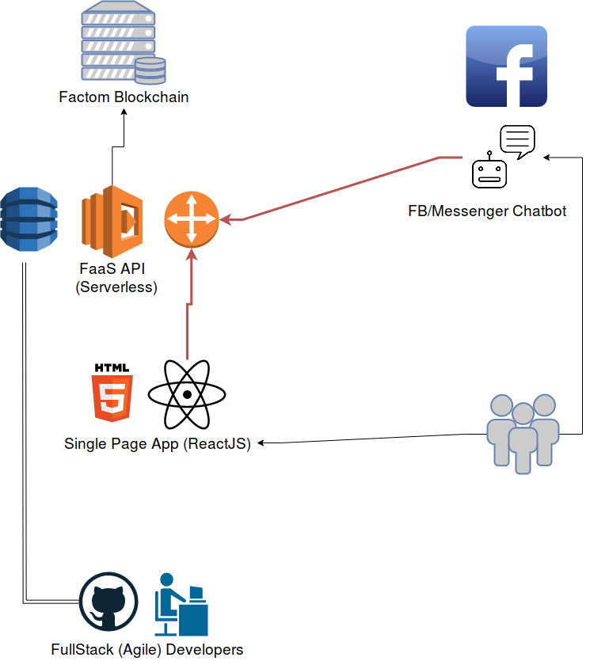

# Progressive Web App to preserve, ensure and validate digital assets.

Initial Steps:

1. Factom blockchain research (read the docs)
2. Implment serverless API to read/write digital assests (document hashes etc)
    -   Auth using AWS cognito
3. Front end application
    -   Auth using AWS cognito
4. Chatbot - read from blockchain
    -   Auth using AWS cognito with Facebook user federation
5. Chatbot - write to blockchain 
    -   Auth using AWS cognito with Facebook user federation
